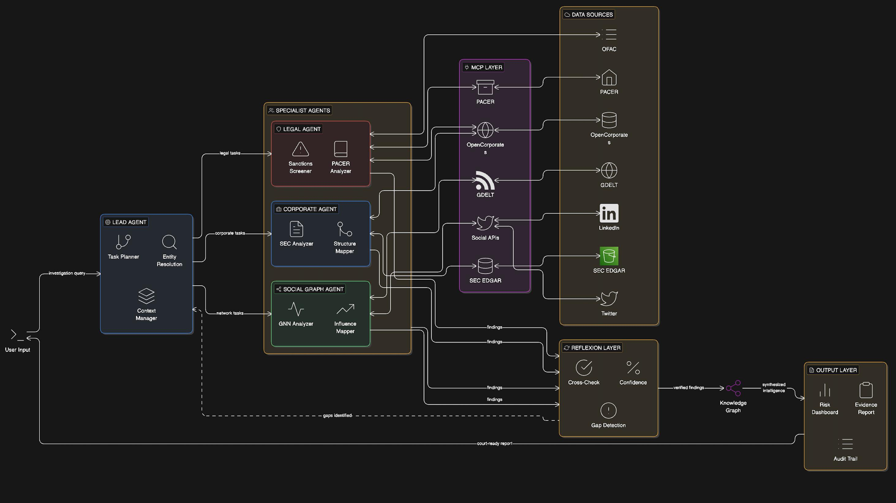

# Autonomous OSINT Investigation Swarm (Capstone)

This repository is the implementation for **Autonomous OSINT Investigation Swarm** — a modular, multi-agent system for corporate/entity risk assessment.

## Architecture



## Quickstart

```bash
# 1. Clone and enter the repo
git clone <repo-url>
cd Repo

# 2. Create & activate a virtual environment
python -m venv .venv
source .venv/bin/activate        # macOS/Linux
# .venv\Scripts\activate         # Windows

# 3. Install dependencies
pip install -r requirements.txt

# 4. Set up your .env (one time)
cp .env.example .env
# Open .env and replace the placeholder with your name/email

# 5. Run the pipeline (Tesla vertical slice)
python scripts/pull_sec_submissions.py --cik 0001318605
python scripts/pull_nhtsa_recalls.py --make TESLA
python scripts/build_evidence_tesla.py
```

**Output**: `data/processed/tesla/evidence_tesla.csv` (91 structured evidence rows from SEC + NHTSA).

## Demo (Flask)

Run the web demo to investigate an entity from the browser:

```bash
pip install -r requirements.txt   # includes Flask
python app/app.py
```

Open **http://127.0.0.1:5000**, enter a query (e.g. *Investigate Tesla for money laundering*), and click **Run investigation**. The app runs the full pipeline (Lead Agent → specialists → reflexion → knowledge graph → report) and shows entity, tasks, findings count, risk dashboard, gaps, evidence report, and audit trail. See [`app/README.md`](app/README.md) for details.

## Repo layout

- `src/osint_swarm/`: core library (schemas + connectors)
- `agents/`: Lead Agent + specialist agents (Corporate, Legal, Social Graph)
- `mcp_layer/`: data layer (SEC, NHTSA, evidence loader)
- `reflexion_layer/`: cross-check, gap detection, confidence
- `knowledge_graph/`: graph built from evidence
- `output_layer/`: evidence report, risk dashboard, audit trail
- `app/`: Flask demo (web UI to run investigations)
- `scripts/`: runnable ingestion/build scripts
- `data/raw/`: cached raw source files (traceability)
- `data/processed/`: normalized evidence tables used by agents
- `docs/`: data sources blueprint + schemas

## Testing

From the project root (with the virtual environment activated):

```bash
pytest tests/unit -v
```

See `pyproject.toml` for pytest configuration (pythonpath includes `src` and project root).

## Documentation

- [`docs/IMPLEMENTATION_PLAN.md`](docs/IMPLEMENTATION_PLAN.md) — Phase-wise implementation plan (Phases 1–7).
- [`docs/schema.md`](docs/schema.md) — Entity and Evidence schema.
- [`docs/data_sources.md`](docs/data_sources.md) — Data sources blueprint.
- [`docs/EVIDENCE_AS_INPUT.md`](docs/EVIDENCE_AS_INPUT.md) — Evidence as canonical agent input.

## Notes

- **Python**: 3.8+ recommended (tested with 3.13).
- The v1 pipeline uses **authoritative, open sources**: SEC EDGAR + NHTSA (plus optional CourtListener artifacts).
- **SEC EDGAR** requires a valid `User-Agent`; set `SEC_USER_AGENT` in `.env` (see `.env.example`).
- NHTSA recall ingestion uses the DOT **DataHub** tabular dataset (public), since the legacy `api.nhtsa.gov/recalls/...` endpoints may return 403.
- Paywalled sources (PACER/Reuters/etc.) are treated as future extensions.

