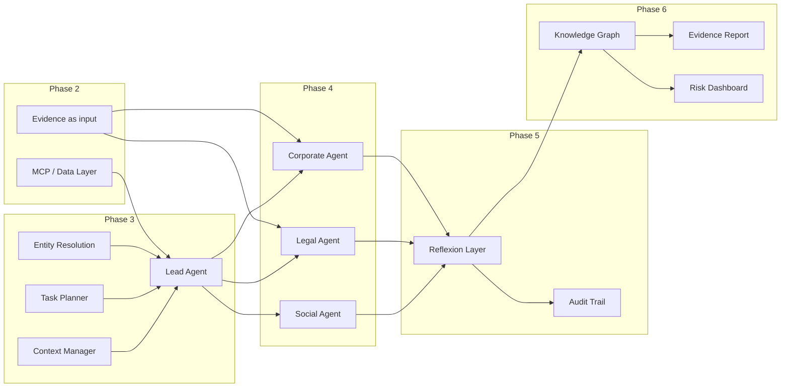

# Implementation Plan: Autonomous OSINT Investigation Swarm

This plan is derived from the **Autonomous OSINT Investigation Swarm** project description (PDF), the **Architecture Diagram**, and the **current progress** in the repo. Items are ordered so that each step builds on the previous one.

---

## Current State Summary

**Done (Phase 1 – Data Infrastructure):**

- **Schemas**: `Entity` and `Evidence` in [`src/osint_swarm/entities.py`](src/osint_swarm/entities.py) with `entity_id`, `source_type`, `risk_category`, `confidence`, etc.
- **Data connectors**: SEC EDGAR (submissions) and NHTSA (recalls via DOT DataHub) in `src/osint_swarm/data_sources/`.
- **Scripts**: `pull_sec_submissions.py`, `pull_nhtsa_recalls.py`, `build_evidence_tesla.py` producing `data/processed/tesla/evidence_tesla.csv` (91 rows).
- **Directory structure**: `agents/`, `mcp_layer/`, `reflexion_layer/`, `knowledge_graph/`, `output_layer/`, plus `data/raw/*` and `data/processed/` with `__init__.py` in place.

**Not yet implemented:**

- Lead Agent (orchestrator, task decomposition, context).
- Specialist agents (Corporate, Legal, Social Graph).
- MCP integration layer (unified data access).
- Reflexion (self-correction, gap detection, confidence).
- Knowledge graph and output layer (dashboard, evidence report, audit trail).
- End-to-end demo (“Investigate Company X for money laundering”).

---

## Phased Plan (What to Do, One by One)

### Phase 2: Data Layer & MCP Alignment

**Goal:** Treat existing connectors as the canonical data backbone and align them with the MCP/data layer so agents depend on a single interface.

| # | Task | Description |
|---|------|-------------|
| 2.1 | **MCP-style interface for existing sources** | Define a small, shared interface (e.g. “fetch by entity/query”) in `mcp_layer/` that the current SEC and NHTSA connectors implement (or wrap). No need for full MCP servers initially—just a clear contract so Lead Agent and specialists call “MCP” instead of raw APIs. |
| 2.2 | **Wire SEC EDGAR and NHTSA into MCP layer** | Implement or adapt `mcp_layer/sec_edgar_processor/` and add an NHTSA processor (or single “regulatory” processor) that use `src/osint_swarm/data_sources/` under the hood. Evidence continues to be produced in the same format as today. |
| 2.3 | **Evidence as canonical agent input** | Document and enforce that agents consume structured evidence (e.g. `data/processed/<entity>/evidence_*.csv` or an in-memory list of `Evidence`) rather than raw JSON. Optional: add a tiny “evidence loader” used by all agents. |

---

### Phase 3: Lead Agent (Orchestrator)

**Goal:** One entry point that turns a natural-language investigation query into sub-tasks and delegates to specialist agents.

| # | Task | Description |
|---|------|-------------|
| 3.1 | **Entity resolution** | Implement `agents/lead_agent/entity_resolution/`: given a query like “Company X” or “Tesla”, resolve to an `Entity` (or list of candidates) with `entity_id`, `identifiers` (e.g. CIK), `entity_type`. Can start with a lookup table or simple rules (e.g. Tesla → CIK 0001318605). |
| 3.2 | **Task planner (decomposition)** | Implement `agents/lead_agent/task_planner/`: Chain-of-Thought style decomposition of “Investigate X for money laundering” into sub-tasks: corporate structure, beneficial ownership, sanctions, transaction patterns, adverse media. Output: a list of (task_type, target_agent, description). |
| 3.3 | **Context manager** | Implement `agents/lead_agent/context_manager/`: holds the current investigation context (entity, query, sub-tasks, results per agent). Provides a single place to read/write “findings so far” so that reflexion and specialists can use it. |
| 3.4 | **Lead Agent orchestration** | Tie 3.1–3.3 together: accept a query → resolve entity → decompose into tasks → allocate to Corporate / Legal / Social Graph agents (stubs if needed) → collect results into context. |

---

### Phase 4: Specialist Agents (Minimal Viable)

**Goal:** Each specialist can consume evidence (and later MCP) and return structured findings. Start with what the current data supports; extend later.

| # | Task | Description |
|---|------|-------------|
| 4.1 | **Corporate Agent** | **SEC Analyzer** (`agents/specialist_agents/corporate_agent/sec_analyzer/`): ingest SEC-derived evidence (from CSV or evidence loader); summarize governance/regulatory red flags (e.g. executive turnover, filings). **Structure Mapper**: stub or simple pass-through; later OpenCorporates when available. |
| 4.2 | **Legal Agent** | **Sanctions Screener** (`agents/specialist_agents/legal_agent/sanctions_screener/`): stub that returns “no sanctions data yet” or integrate a free OFAC/sanctions list if feasible. **PACER Analyzer**: stub or placeholder (PACER paywalled; CourtListener optional later). |
| 4.3 | **Social Graph Agent** | **GNN Analyzer** and **Influence Mapper**: stubs that return “no social graph data yet” (Twitter/LinkedIn noted as future). Keeps the architecture intact for the demo. |
| 4.4 | **Agent contract** | Define a common interface for specialists: e.g. `run(entity_id, task_description, context) -> List[Evidence]` (or a small “Finding” type). Lead Agent calls this for each allocated task. |

---

### Phase 5: Reflexion & Quality Assurance

**Goal:** Self-correction and transparency as in the PDF: gap detection, confidence, audit trail.

| # | Task | Description |
|---|------|-------------|
| 5.1 | **Cross-check** | Implement `reflexion_layer/cross_check/`: compare findings from different agents for consistency (e.g. same executive name, same date). Flag conflicts. |
| 5.2 | **Gap detection** | Implement `reflexion_layer/gap_detection/`: given investigation objectives and current findings, list missing pieces (e.g. “no sanctions check”, “no PACER data”). Optionally output “suggested follow-up queries” for the Lead Agent. |
| 5.3 | **Confidence module** | Implement `reflexion_layer/confidence_module/`: aggregate confidence from evidence (already in schema); optionally adjust by source reliability and corroboration. Expose a per-finding or per-dimension confidence score. |
| 5.4 | **Audit trail** | Implement `output_layer/audit_trail/`: log every query, data source accessed, and reasoning step (e.g. in JSON or structured log). Ensures chain of custody for “forensic-style” evidence. |

---

### Phase 6: Knowledge Graph & Output Layer

**Goal:** Turn verified findings into a graph and then into reports and a simple dashboard.

| # | Task | Description |
|---|------|-------------|
| 6.1 | **Knowledge graph** | Implement `knowledge_graph/`: build an in-memory (or simple persisted) graph from evidence—nodes = entities/documents, edges = relationships (e.g. “mentioned in same filing”, “same recall”). Feed from reflexion “verified findings.” |
| 6.2 | **Evidence report generator** | Implement `output_layer/evidence_report_generator/`: from evidence + knowledge graph, produce a human-readable report (e.g. Markdown or HTML) with source citations and confidence. |
| 6.3 | **Risk dashboard** | Implement `output_layer/risk_dashboard/`: composite risk score (e.g. governance, regulatory, legal, network) from evidence and confidence; optional trend or dimension breakdown. Can be CLI or a simple web view. |

---

### Phase 7: End-to-End Demo & Polish

**Goal:** Single flow that matches the PDF demo: “Investigate Company X for money laundering.”

| # | Task | Description |
|---|------|-------------|
| 7.1 | **Demo entry point** | Single script or command: input = entity name or ID; flow = Lead Agent → task decomposition → specialist agents (Corporate, Legal, Social stubs) → reflexion (cross-check, gap detection, confidence) → knowledge graph → evidence report + risk dashboard + audit trail. |
| 7.2 | **Timeline alignment (optional)** | If desired, align with PDF timeline: 0–30 s decomposition, 30–90 s parallel retrieval, 90–180 s analysis, 180+ s reflexion. Can be simulated or real depending on data size. |
| 7.3 | **Documentation and README** | Update README and `docs/WALKTHROUGH.md` with: how to run the full demo, where each component lives (agents, mcp_layer, reflexion, output), and what is stub vs. implemented. |

---

## Dependency Overview

---

## Suggested Order of Implementation (Checklist)

1. **Phase 2**: MCP-style interface + wire SEC/NHTSA → evidence as canonical input.
2. **Phase 3**: Entity resolution → task planner → context manager → Lead Agent orchestration.
3. **Phase 4**: Corporate Agent (SEC + stub Structure Mapper) → Legal and Social stubs → common agent contract.
4. **Phase 5**: Cross-check → gap detection → confidence module → audit trail.
5. **Phase 6**: Knowledge graph → evidence report → risk dashboard.
6. **Phase 7**: Demo entry point → docs/README updates.

This order keeps dependencies consistent: data and orchestration first, then specialists, then reflexion and output, and finally the full demo and documentation.
