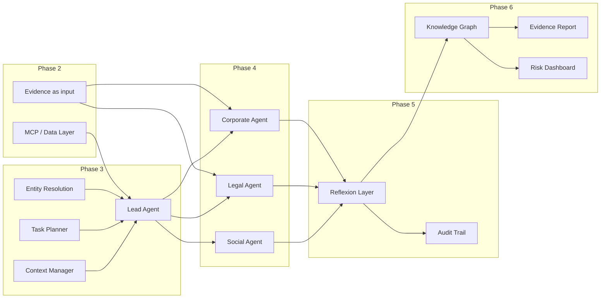

# Implementation Plan: Autonomous OSINT Investigation Swarm

This document describes the **phase-wise implementation plan** for the Autonomous OSINT Investigation Swarm, derived from the project description (PDF) and the Architecture Diagram. Each phase builds on the previous one.

---

## Phase 1: Data Infrastructure

**Goal:** Establish the foundation: schemas, data connectors, and a scripted pipeline that pulls raw data from trusted sources, caches it, and produces structured Evidence for downstream consumers.

| # | Task | Description |
|---|------|-------------|
| 1.1 | **Schemas** | Define `Entity` and `Evidence` in `src/osint_swarm/entities.py`: entity_id, name, entity_type, identifiers; evidence_id, entity_id, date, source_type, risk_category, summary, source_uri, raw_location, confidence, attributes. |
| 1.2 | **Data connectors** | Implement SEC EDGAR connector (fetch submissions by CIK, cache JSON) and NHTSA connector (fetch recalls by make via DOT DataHub, cache JSON) in `src/osint_swarm/data_sources/`. |
| 1.3 | **Scripts** | Provide runnable scripts: pull SEC submissions and NHTSA recalls into `data/raw/`; build Evidence from raw data and write CSV to `data/processed/`. |
| 1.4 | **Utilities and layout** | I/O helpers (read_json, write_json, write_csv_dicts) and a directory layout that matches the architecture (agents, mcp_layer, reflexion_layer, knowledge_graph, output_layer, data/raw, data/processed). |

---

## Phase 2: Data Layer & MCP Alignment

**Goal:** Expose a single, consistent interface (MCP-style) for data access so that agents depend on the data layer rather than calling connectors or scripts directly. Evidence is the canonical input for all agents.

| # | Task | Description |
|---|------|-------------|
| 2.1 | **MCP-style interface** | Define a shared contract in `mcp_layer/` (e.g. abstract processor with `get_evidence_for_entity(entity)` returning `List[Evidence]`). Document that agents must use the MCP layer, not `osint_swarm.data_sources` directly. |
| 2.2 | **Wire SEC and NHTSA into MCP layer** | Implement `mcp_layer/sec_edgar_processor/` and an NHTSA processor that use existing connectors, read from or write to `data/raw/`, and return `List[Evidence]`. |
| 2.3 | **Evidence as canonical input** | Document that agents consume structured Evidence (from MCP or from an evidence store). Optionally add an evidence loader that loads `data/processed/<entity>/evidence_*.csv` and returns `List[Evidence]`. |

---

## Phase 3: Lead Agent (Orchestrator)

**Goal:** One entry point that accepts a natural-language investigation query, resolves the entity, decomposes the query into sub-tasks, and delegates to specialist agents.

| # | Task | Description |
|---|------|-------------|
| 3.1 | **Entity resolution** | Implement `agents/lead_agent/entity_resolution/`: given a query (e.g. “Company X”, “Tesla”), resolve to an `Entity` with entity_id, identifiers (e.g. CIK), entity_type. Start with a lookup table or simple rules. |
| 3.2 | **Task planner** | Implement `agents/lead_agent/task_planner/`: decompose queries (e.g. “Investigate X for money laundering”) into sub-tasks: corporate structure, beneficial ownership, sanctions, transaction patterns, adverse media. Output: list of (task_type, target_agent, description). |
| 3.3 | **Context manager** | Implement `agents/lead_agent/context_manager/`: hold investigation context (entity, query, sub-tasks, results per agent) so reflexion and specialists can read/write findings in one place. |
| 3.4 | **Lead Agent orchestration** | Tie entity resolution, task planner, and context manager together: accept query → resolve entity → decompose → allocate tasks to Corporate / Legal / Social Graph agents → collect results into context. |

---

## Phase 4: Specialist Agents (Minimal Viable)

**Goal:** Each specialist consumes evidence (via MCP or context) and returns structured findings. Start with what the current data supports; use stubs where data is not yet integrated.

| # | Task | Description |
|---|------|-------------|
| 4.1 | **Corporate Agent** | SEC Analyzer: ingest SEC-derived evidence, summarize governance/regulatory red flags (e.g. executive turnover, filings). Structure Mapper: stub or pass-through; later OpenCorporates. |
| 4.2 | **Legal Agent** | Sanctions Screener: stub or integrate OFAC/sanctions list. PACER Analyzer: stub (PACER paywalled; CourtListener optional later). |
| 4.3 | **Social Graph Agent** | GNN Analyzer and Influence Mapper: stubs (Twitter/LinkedIn noted as future). |
| 4.4 | **Agent contract** | Define a common interface for specialists (e.g. `run(entity, task, context) -> List[Evidence]`). Lead Agent calls this for each allocated task. |

---

## Phase 5: Reflexion & Quality Assurance

**Goal:** Self-correction and transparency: cross-check findings, detect gaps, aggregate confidence, and maintain an audit trail.

| # | Task | Description |
|---|------|-------------|
| 5.1 | **Cross-check** | Implement `reflexion_layer/cross_check/`: compare findings across agents for consistency (e.g. same entity/date, conflicting claims). Flag conflicts. |
| 5.2 | **Gap detection** | Implement `reflexion_layer/gap_detection/`: given investigation objectives and current findings, list missing pieces (e.g. no sanctions data, no PACER). Optionally suggest follow-up queries. |
| 5.3 | **Confidence module** | Implement `reflexion_layer/confidence_module/`: aggregate confidence from evidence; optionally adjust by source reliability. Expose per-finding or per-dimension confidence. |
| 5.4 | **Audit trail** | Implement `output_layer/audit_trail/`: log every query, data source accessed, and reasoning step (e.g. JSON or structured log) for chain of custody. |

---

## Phase 6: Knowledge Graph & Output Layer

**Goal:** Turn verified findings into a graph and into human-readable reports and a risk dashboard.

| # | Task | Description |
|---|------|-------------|
| 6.1 | **Knowledge graph** | Implement `knowledge_graph/`: build an in-memory (or simple persisted) graph from evidence—nodes = entities/documents, edges = relationships (e.g. has_evidence, same_source_type). |
| 6.2 | **Evidence report generator** | Implement `output_layer/evidence_report_generator/`: produce a human-readable report (Markdown or HTML) with source citations and confidence from evidence and optional graph summary. |
| 6.3 | **Risk dashboard** | Implement `output_layer/risk_dashboard/`: composite risk score by dimension (governance, regulatory, legal, network) from evidence and confidence; CLI or simple web view. |

---

## Phase 7: End-to-End Demo & Polish

**Goal:** A single flow that matches the demo: “Investigate Company X for money laundering,” with optional web UI and documentation.

| # | Task | Description |
|---|------|-------------|
| 7.1 | **Demo entry point** | Single script or command (and optionally a web app): input = investigation query; flow = Lead Agent → specialists → reflexion → knowledge graph → evidence report + risk dashboard + audit trail. |
| 7.2 | **Timeline alignment (optional)** | If desired, align with PDF timeline (e.g. 0–30 s decomposition, 30–90 s retrieval, 90–180 s analysis, 180+ s reflexion). |
| 7.3 | **Documentation** | Update README and docs (e.g. WALKTHROUGH) with how to run the full demo, where each component lives, and what is stub vs. implemented. |

---

## Dependency Overview

---

## Order of Implementation

1. **Phase 1** — Data infrastructure (schemas, connectors, scripts, layout).
2. **Phase 2** — MCP-style interface, wire SEC/NHTSA, evidence as canonical input.
3. **Phase 3** — Entity resolution, task planner, context manager, Lead Agent orchestration.
4. **Phase 4** — Corporate Agent (SEC + Structure Mapper), Legal and Social Graph agents (stubs), agent contract.
5. **Phase 5** — Cross-check, gap detection, confidence module, audit trail.
6. **Phase 6** — Knowledge graph, evidence report generator, risk dashboard.
7. **Phase 7** — Demo entry point (script and/or web app), optional timeline, documentation.

This order keeps dependencies consistent: data and orchestration first, then specialists, then reflexion and output, then the full demo.
